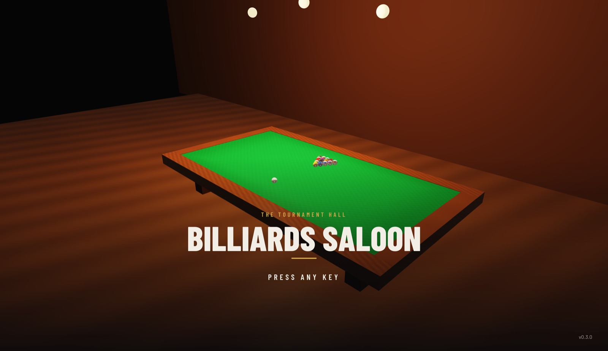
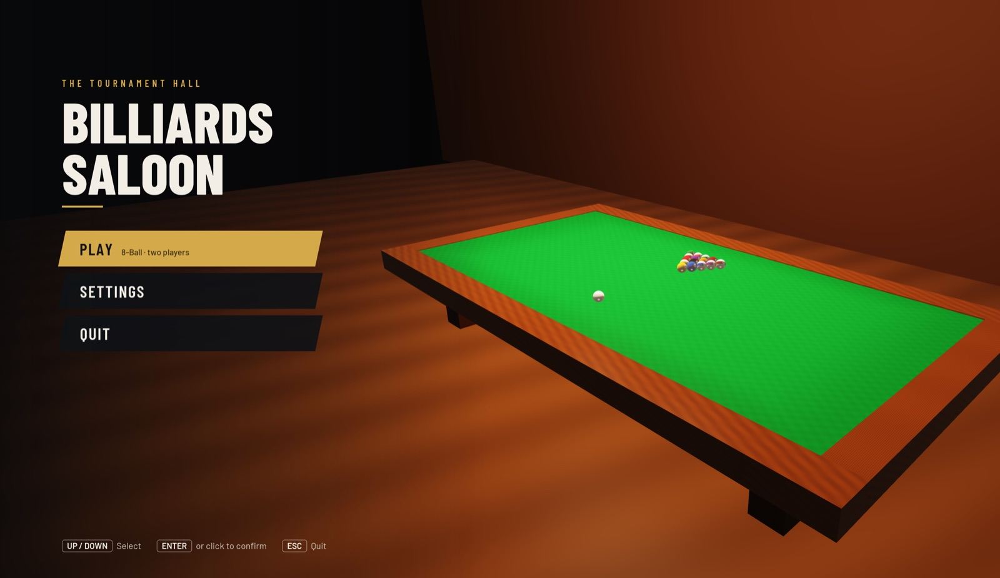
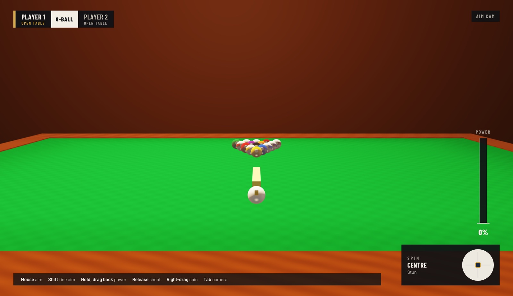
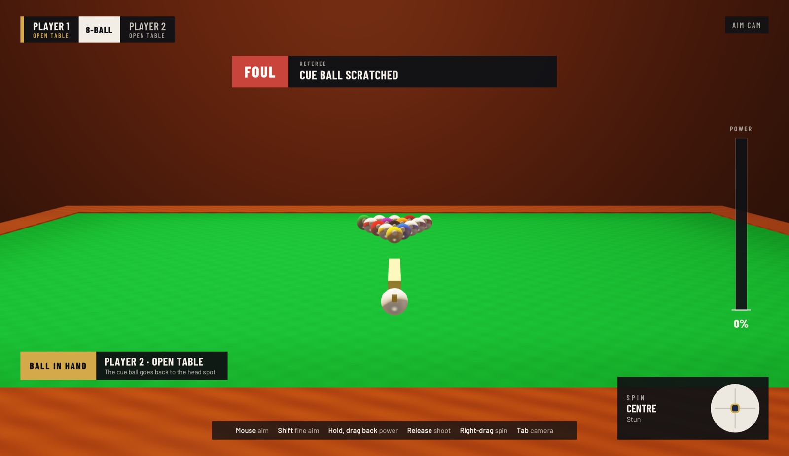
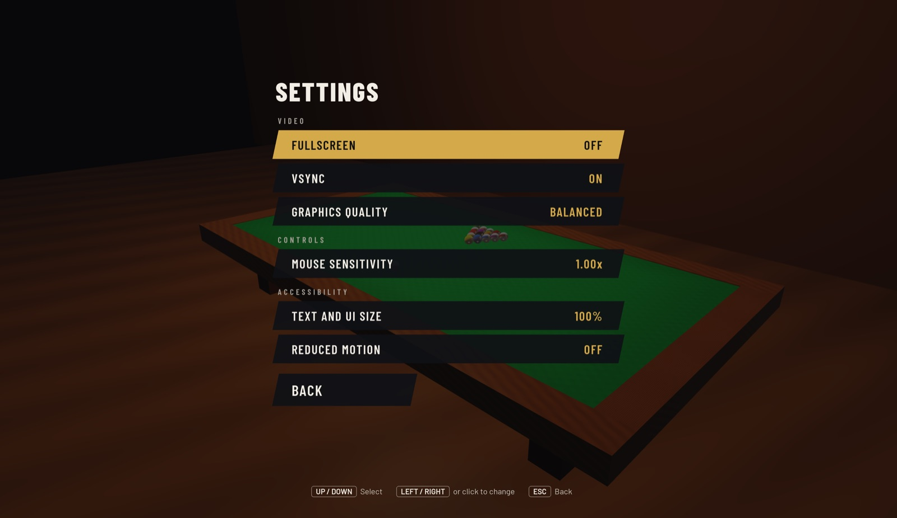
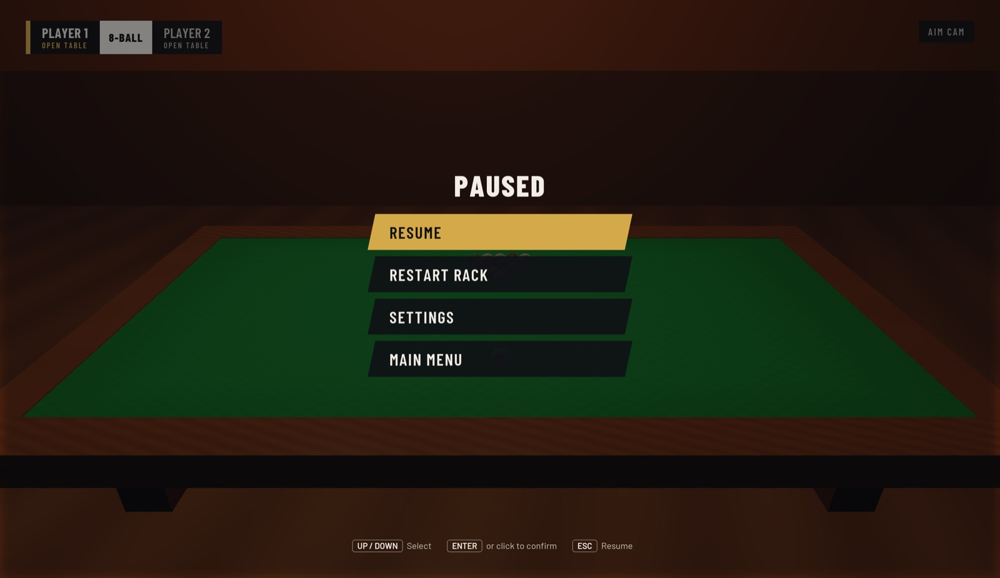

# Billiards Saloon

A realism-first 3D pool game presented like a televised tournament.
Built from scratch in C++20 and OpenGL 4.1 — no game engine.

> **Status:** early development. `v0.3.0` is a playable two-player 8-ball
> game with the broadcast frontend. Work toward v1.0 (event-based physics, full WPA rules,
> AI opponents, career mode) is tracked in [`docs/ARCHITECTURE.md`](docs/ARCHITECTURE.md).

## Screenshots

| Title | Main hub |
|-------|----------|
|  |  |
| **Aiming** | **Referee call after a scratch** |
|  |  |
| **Settings** | **Pause** |
|  |  |

Work in progress: the menus and HUD are final in style; table lighting and
materials are scheduled for the hall-visuals milestone.

## What works today

- 8-ball against a second local player: break, open table, group assignment,
  first-contact and scratch fouls, turn changes, win/loss on the 8.
- Cue strike with power and tip offset (english, follow, draw).
- Physics: sliding→rolling cloth model with spin, ball-ball and cushion
  impulses with friction, pocket capture.
- Camera modes: aim, table overview, shot follow, free look.
- Broadcast-style main menu, pause menu and in-match HUD (RmlUi): scorebug,
  ball trays, power meter, spin widget, referee banners that name each foul,
  and a frame-over card.
- Low/Balanced/High render quality.

## Build

Requires CMake ≥ 3.28, a C++20 compiler and OpenGL 4.1. GLFW, GLM and doctest are
fetched automatically; GLAD is bundled in `external/`.

```bash
cmake -B build -DCMAKE_BUILD_TYPE=Debug
cmake --build build -j8
./build/BilliardsSaloon
ctest --test-dir build --output-on-failure   # unit tests
```

## Controls

| Action | Mouse | Keyboard | Gamepad |
|--------|-------|----------|---------|
| Aim | Move the mouse (Shift: fine) | A / D (Shift: fine) | Left stick (LB: fine) |
| Shoot | Hold left button, drag back, release | Hold Space, release | Hold A, release |
| Cancel a shot | Push forward again and release | — | — |
| Spin (cue tip offset) | Hold right button and move | Arrow keys, C to centre | Right stick, X to centre |
| Camera views | — | Tab cycles; 1 aim, 2 overview, 3 follow, 4 free look | Y cycles |
| Free look | Right-drag to orbit, wheel to zoom | J/L orbit, I/K tilt, U/O zoom | Right stick orbit, triggers zoom |
| Menus | Point and click | Up/Down, Enter, Esc | D-pad or left stick, A, B |
| Pause | — | Esc | Start |
| Settings | Main or pause menu | Left/Right change a value | D-pad Left/Right |
| Fullscreen | Settings | F11, Alt+Enter, or Cmd+Ctrl+F on macOS | Settings |

On-screen prompts switch between keyboard/mouse and gamepad wording
depending on the device used last.

## Developer options

```bash
./build/BilliardsSaloon --screen game                      # skip the main menu
./build/BilliardsSaloon --screen pause --capture pause.png # save a screenshot and quit
```

## Project layout

| Path | Contents |
|------|----------|
| `src/app` | Main loop, menus, input, drawing |
| `src/ecs` | Sparse-set entity/component registry |
| `src/physics` | Ball, cushion and pocket simulation |
| `src/gameplay` | Game variants, match state, 8-ball rules |
| `src/render` | Shaders, meshes, cameras, overlay text, screenshots |
| `src/ui` | RmlUi integration (fonts, input, rendering) |
| `assets/ui` | Menu documents (`.rml`) and the shared stylesheet (`theme.rcss`) |
| `assets/shaders` | GLSL shaders |
| `docs` | Design document and architecture roadmap |

## Blueprint

The full design lives in [`docs/`](docs/README.md). In short:

- **Physics** ([PHYSICS.md](docs/design/PHYSICS.md)) — today a fixed-step
  solver with an analytic cloth model: sliding balls decelerate at `μ_s·g`
  until the slip vanishes after `2|u|/(7μ_s·g)`, then roll at `μ_r·g`;
  collisions use impulses with Coulomb friction for throw and spin transfer.
  Milestone M3 replaces it with an event-based simulator (Leckie–Greenspan /
  pooltool): every ball follows closed-form motion between events, event times
  come from quadratic and quartic equations, and a whole shot is computed
  exactly at the strike, with real cushion geometry, pocket jaws, squirt,
  swerve and massé.
- **AI and machine learning** ([INTELLIGENCE.md](docs/design/INTELLIGENCE.md)) —
  a search over candidate shots under execution noise, guided by value and
  policy networks trained by self-play (expert iteration, AlphaZero-style) on
  the game's own simulator. Trained in Python/PyTorch, shipped through ONNX
  Runtime. The same models power AI pros with personalities, an AI coach
  (best shot, where the cue ball should have finished, shot difficulty),
  adaptive difficulty and generated challenges.
- **Experience** ([UX.md](docs/design/UX.md), [GDD.md](docs/design/GDD.md)) —
  a televised-final presentation: broadcast scorebug, referee calls that name
  every foul, replays and a director camera over a live 3D tournament hall;
  WPA rules for 8-, 9- and 10-ball; Quick Match, Practice, Trick Shots and a
  career tour.
- **Code** ([ARCHITECTURE.md](docs/ARCHITECTURE.md)) — C++20, OpenGL 4.1,
  no engine; a headless game library that tests (and later the AI) link
  without graphics.

## Roadmap

See [`docs/design/GDD.md`](docs/design/GDD.md) for the v1.0 game design and
[`docs/ARCHITECTURE.md`](docs/ARCHITECTURE.md) for the technical plan.
